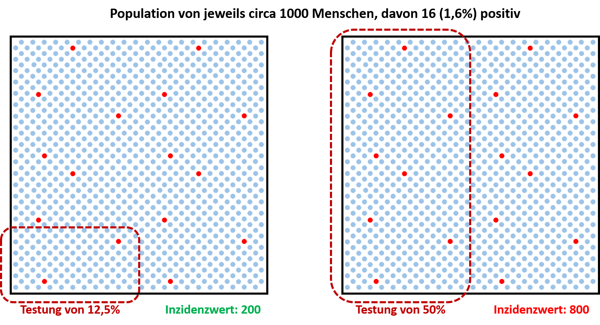

# 1.1 Anzahl der Tests

#### Kritik: "Die Anzahl der durchgeführten Tests wird bei Entscheidungen über Maßnahmen nicht oder nur unzureichend berücksichtigt."

Corona-Tests helfen dabei infizierte Menschen zu detektieren. 
Diese Personen, sowie auch enge Kontaktpersonen der vorangegangenen Tage können in einer Quarantäne 
untergebracht werden, was eine weitere Ausbreitung des Virus verhindert. 

Zusätzlich wird aber die Anzahl der positiven Tests als quantitaves Maß für die 'Stärke' der 
Pandemie verwendet. Derzeit geschieht dies über den sogenannten Inzidenzwert. 
Der Inzidenzwert berechnet sich dabei aus der Anzahl der positiv Getesteten je *100.000* Einwohner in den 
vorangegangen *7* Tagen. 
Dieser Wert ist unabhängig davon, wie viele Menschen unter den *100.000* tatsächlich getestet wurden.
Wenn also in *7* Tagen *25* positive Fälle in einer Region mit *100.000* Einwohnern gefunden wurden, 
dann ergibt sich ein Inzidenzwert von *25*. Bei *50* positive Fälle wäre es eine Inzidenz von *50*, und so weiter.

Dieses Maß bringt jedoch einige Risiken mit sich, insbesondere wenn zusätzlich zu den Menschen mit 
konkretem Verdacht auf CoViD-19 sich noch viele Menschen ohne Symptome testen lassen: 
Wenn doppelt so viele Menschen getestet werden, können auch etwa doppelt so 
viele positive Tests erwartet werden. Folglich ist natürlich auch der Inzidenzwert deutlich erhöht. 
Ironischerweise führte der erhöhte Inzidenzwert sogar zu noch mehr Tests von Menschen ohne Verdacht
auf Corona, wodurch der Inzidenzwert noch weiter stieg.

In der Nachfolgenden Abbildung ist ein Beispiel mit zwei Dörfern dargestellt, 
welche jeweils etwa *1000* Einwohner haben und von denen jeweils *16* oder *1,6%* 
positiv sind. In dem linken Dorf werden in einer Woche *12,5%* der Einwohner 
(zufällig und symptomlos) getestet. 
Unter den *125* Getesteten wurden *2* Menschen positiv getestet. 
Da die Anzahl der positiv Getesteten ins Verhältnis mit allen *1000* Einwohnern gesetzt und
anschließend für *100.000* Einwohner hochgerechnet wird, 
ergibt sich ein Inzidenzwert von 
.  
 

Würde dieser Inzidenzwert nun dazu führen, dass im Nachbardorf mit gleich vielen 
Einwohnern und Positiven nicht nur *12,5%* sondern sogar *50%* der Menschen getestet werden,
dann steigt der Inzidenzwert auf 
. 
**Der Inzidenzwert wird also durch die Erhöhung der Testrate vergrößert.**
Daraus folgt, dass der Inzidenzwert nicht als alleiniges Maß für die "Stärke" der Pandemie 
herangezogen werden darf.

Einige Mathematiker fordern, die Anzahl der positiven Tests ins Verhältnis mit allen Tests zu setzen. 
Das würde bei der Testung von symptomlosen Menschen tatsächlich helfen, birgt aber die Gefahr 
einer starken Überschätzung, wenn hauptsächlich Menschen mit Symptomen getestet werden. 
Ein Beispiel: Wenn eine kleine Gruppe von Reiserückkehrern mit starken Symptomen einer 
Tropenkrankheit auf diese getestet werden, und die Hälfte davon tatsächlich positiv ist, 
dann kann dieses Verhältnis keinesfalls auf die restliche Bevölkerung übertragen werden.
Ansonsten könnte man fälschlicherweise schließen, dass die Hälfte der Bevölkerung 
eine Tropenkrankheit hat.

Eine bessere Möglichkeit wäre, bei der Testung die Information zu berücksichtigen, ob Symptome 
vorliegen oder die betreffende Person Kontakt zu einer an CoViD-19 erkrankten Person hatte.
Diese Information hilft dabei, das Verhältnis der positiven Tests unter den Menschen ohne Verdacht 
auf CoViD-19 unter Berücksichtigung der Testgüte (Sensitivität und Spezifität) auf die Bevölkerung 
hochzurechnen. Dies würde tatsächlich einen Wert liefern, welcher als Maß für die "Stärke" der 
Pandemie herangezogen werden kann und auf Basis dessen Handlungsmaßnahmen beschlossen werden können.

## Weiterführende Inhalte:

 -  Video von **Prof. Dr. Christian Rieck** über die spieltheoretische Perspektive bei der Verwendung 
 der Inzidenz als Referenzgröße für die Stärke der Maßnahmen. 
 Er erklärt warum es ein Problem ist, dass auf den Inzidenzwert sehr einfach Einfluss genommen werden kann.  
  
 
 
[Nächster Punkt: Sensitivität und Spezifität](../2/SensitivitätUndSpezifität.ipynb)
