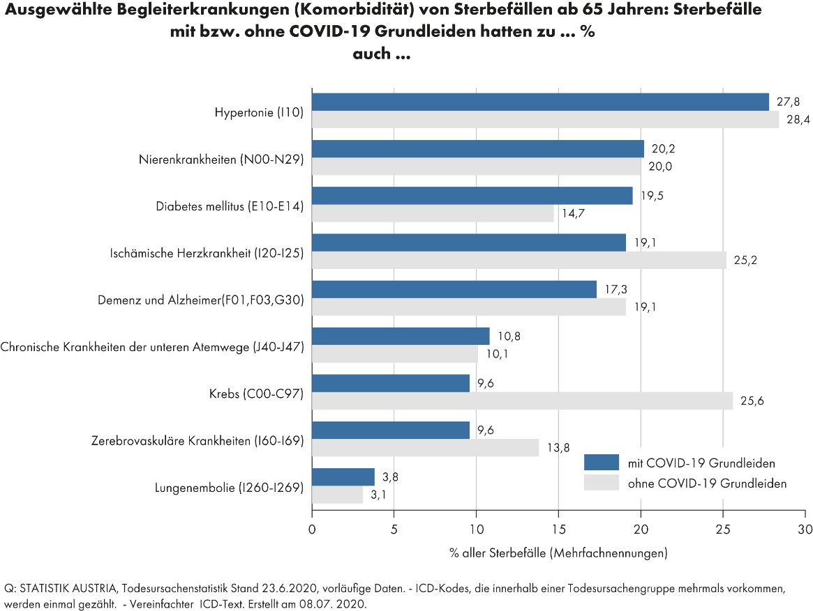

# 1.3 An oder mit CoViD-19 verstorben

#### Kritik: Eine eingetragene Begleitkrankheit von CoViD-19 (*U07* im ICD-Code) wird meist als hauptsächliche Todesursache angeführt und führt somit zu einer Verzerrung der Statistik.

Laut Statistik Austria sind im Jahr 2020 6477 (oder 7,16 %) Verstorbene unter dem 
ICD-Code *CoViD-19 - U07* [1] eingetragen. 
Die ICD-Codes sind dabei eindeutige Kennzeichner für Krankheiten, welche bei Sterbefälle standardmäßig 
als Todesursache angegeben werden.  
Was laut den offiziellen Angaben bei Corona neu ist, ist, dass sich die Zählweise unterscheidet. 
So werden alle Verstorbene mit einer CoViD-19 Diagnose jünger als 28 Tage, mit Ausnahme von Unfällen, 
nur als *CoViD-19-U07* gezählt [2]. 
So wird also ein Mensch, der nach einem Schlaganfall gesundheitlich stark eingeschränkt ist und stirbt, 
zusätzlich jedoch einen positiven CoViD Test innerhalb der vorangegangenen 28 hatte, 
als CoViD-Verstorbener mit Code *U07* gezählt. 
Diese unterschiedliche Zählweise von unterschiedlichen Krankheiten verzerren natürlich die 
Sterbefälle mit Code *CoViD-U07*. 
Die Fallzahlen, welche in den Medien präsentiert werden, sind in Folge auch stark nach oben verzerrt.

Eine zentrale Frage welche bei dieser Zählweise häufig gestellt wird ist, 
ob die Menschen auch ohne der Begleitkrankheit *CoViD-19-U07* gestorben wären. 
Dazu ist die folgende Grafik interessant [3].
Diese zeigt für "ausgewählte Begleiterkrankungen" jeweils einen Balken für „mit COVID-19 Grundleiden“ und 
„ohne COVID-19 Grundleiden“. 
So hatten etwa 27,8 % der Verstorbenen Hypertonie und CoViD-19, 
und 28,4 % der Verstorbenen Hypertonie und kein CoViD-19. 
(Es ist zu beachten, dass einige Verstorbene mehrere Krankheiten hatten, wie Hypertonie und Nierenkrankheiten, somit ist die Summe der Werte >= 100.)
Aus den Verhältnissen kann unter anderem interpretiert werden, 
dass Diabetes mellitus in Kombination mit CoViD-19 die Sterbewahrscheinlichkeit deutlich erhöht. 
Zusätzlich sieht man auch, dass bei Krebs der Balken für „ohne COVID-19 Grundleiden“ signifikant höher ist. 
Das könnte den Grund haben, dass sich Krebspatienten im fortgeschrittenen Stadium ihrem Risiko sehr 
bewusst sind und somit sich selbst und deren Angehörige besonders gut gegen eine Ansteckung schützen.

Grundsätzlich kann auch interpretiert werden, dass die Wahrscheinlichkeiten bei dem Großteil der 
Krankheiten zwischen „mit COVID-19 Grundleiden“ und „ohne COVID-19 Grundleiden“ vergleichbar sind. 
Somit ist die Behauptung, dass viele der Verstorbenen mit COVID-19 ohne diese Krankheit nicht verstorben
wären falsch. 
Die Prävalenz von Corona erhöht also nicht die Morbidität der meisten gezeigten Krankheiten. 
Aus diesem Grund ist die aktuelle Zählweise nicht vertretbar. 
CoViD-19 ist häufig eine Begleitkrankheit und sollte auch als diese gezählt werden.

## Quellen:
 - 1: ICD-Codes: https://www.icd-code.de/
 - 2: ICD-Code-U07 Zählweise. Die exakte Zählweise ist hier in dem ausgewiesenen roten Kasten nachzulesen: https://www.statistik.at/web_de/presse/125475.html
 - 3: Grundleiden von CoViD-19 bei Sterbefällen: https://www.statistik.at/wcm/idc/groups/b/documents/webobj/mdaw/mtiz/~edisp/123855.png

[1]: https://www.icd-code.de/
[2]: https://www.statistik.at/web_de/presse/125475.html
[3]: https://www.statistik.at/wcm/idc/groups/b/documents/webobj/mdaw/mtiz/~edisp/123855.png

