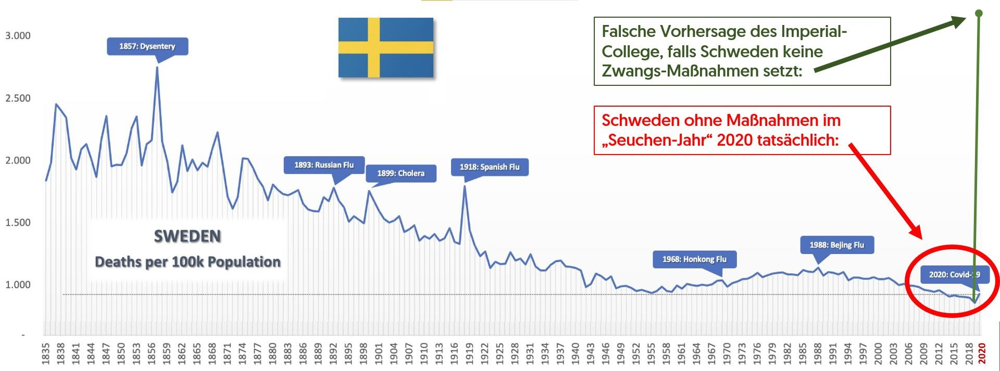
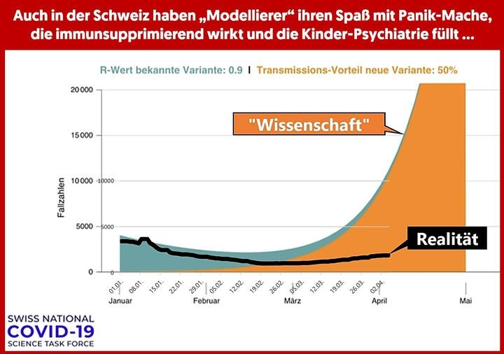

# 2.3. Prädiktive Modelle waren bisher kaum erfolgreich

#### Kritik: Zurückblickend waren jene prädiktive Modelle welche vergangene Maßnahmen rechtfertigten nicht erfolgreich.

Modelle besitzen oftmals eine hohe Anzahl an Freiheitsgraden, wodurch es selbst für Experten schwierig ist, zu erahnen wie gut eine Verkettung von vielen an und für sich plausiblen Schritten wirklich funktioniert. Bei prädiktiven, sprich vorausschauende Modelle, gibt es noch die Schwierigkeit, dass sich die Zukunft nie genauso verhält wie die Vergangenheit. Aus diesem Grund ist es schwierig die veränderten Variablen der Umgebung in ein Modell einzubinden, um auch in der Zukunft präzise zu sein. Nichtsdestotrotz haben wissenschaftliche prädiktive Modelle den Anspruch, besser zu sein als eine naive Schätzung. Erschreckenderweise war das oftmals nicht der Fall. 

Besonders tragisch ist, dass eine Vorhersage des Imperial Colleges als Entscheidungshilfe diente. Dieses Modell lag aber bei der Schätzung der Übersterblichkeit in Schweden im Vergleich zum Vorjahr um etwa 2000% daneben. Anstatt der tatsächlichen Übersterblichkeit von etwa 10% sagte deren Modell 200% vorher.
 

 
Die Mathematikerin Tanja Stadler mit Professur an der ETHZ und Mitglied der „swiss national covid-19 science task force“ forschte an Virusmutationen und prognostizierte einen sehr hohen Verlauf für die Corona-Mutation B1.1.7. Sie ging dabei von einem Transmissionsvorteil von der Mutation von 50% aus, welche aus verschiedenen Quellen entnommen wurden. Daraus schloss sie fälschlicherweise, dass dieser Transmissionsvorteil von 50% auch zu einer Erhöhung des R-Wertes von 50% führt. Das ist jedoch ein falscher Schluss. Ein Transmissionsvorteil führt zu einer Erhöhung der Ansteckungswahrscheinlichkeit, kann aber nicht proportional zu diesem sein. Wenn dem so wäre, würde eine angenommene Ansteckungswahrscheinlichkeit von 80% zwischen zwei Personen in einem Haushalt bei der neuen Variante auf 1,5*80%=120% steigen. Das ist natürlich sinnlos. Die Proportionalität ist nur bei sehr kleinen Ansteckungswahrscheinlichkeiten annähernd gegeben, bei höheren tritt ein Sättigungseffekt ein. Da in der Realität die meisten Ansteckungen bei zeitlich unterschiedlichen, jedoch räumlich engen Kontakten passieren und dort eben nicht einfach mit dem Faktor von 1,5 multipliziert werden darf, weil ein Sättigungseffekt existieren muss, ist der R-Wert eben nicht um den Faktor 1,5 höher.
 

Bildquelle: Roman Braun, Informationsquelle: https://youtu.be/YXV6V3McQGY?t=3240

## Quellen:
 - Quelle zu den offiziellen historischen Zahlen: http://www.scb.se/.../fbc.../be0101_tab9utveng1749-2019.xlsx 
 - Quellen zu den offiziellen Zahlen 2020 "Todesfälle/100k": 1. Einwohner 2020 http://www.scb.se/.../population.../population-statistics/ 2. Todesfälle 2020: http://www.scb.se/.../tab.../preliminar-statistik-over-doda/
 - Die Prognosen des Imperial Colleges werden kritisiert: https://www.aier.org/article/imperial-college-model-applied-to-sweden-yields-preposterous-results/

